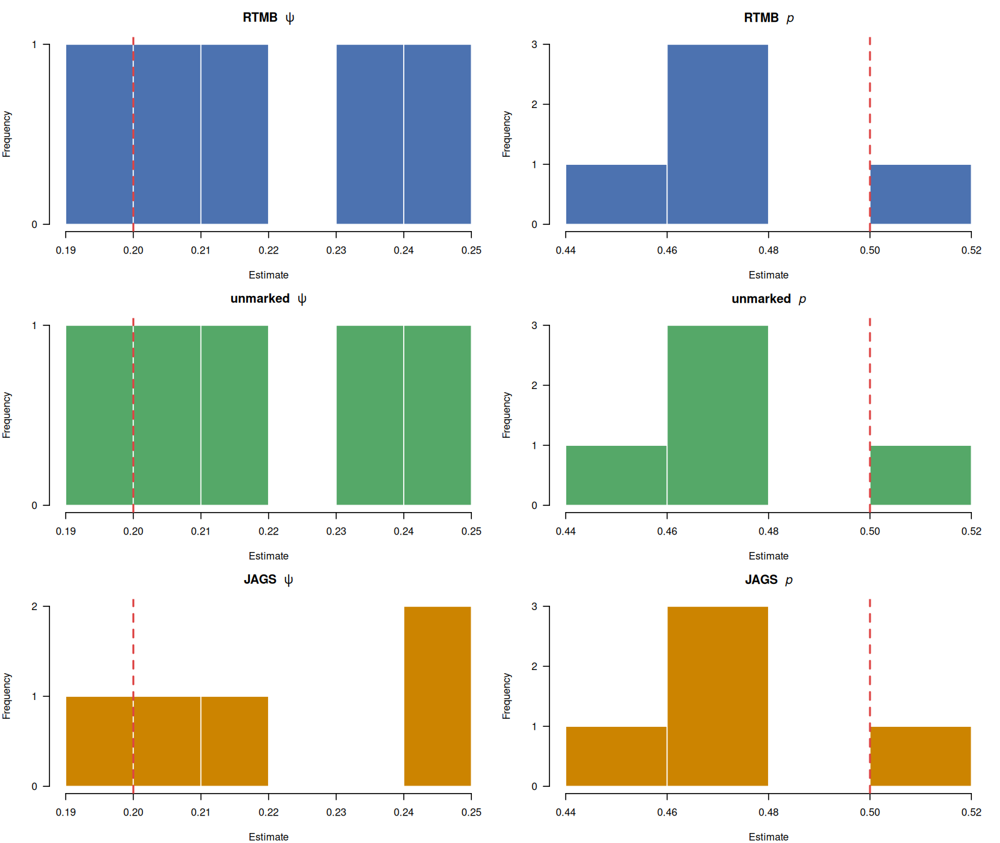
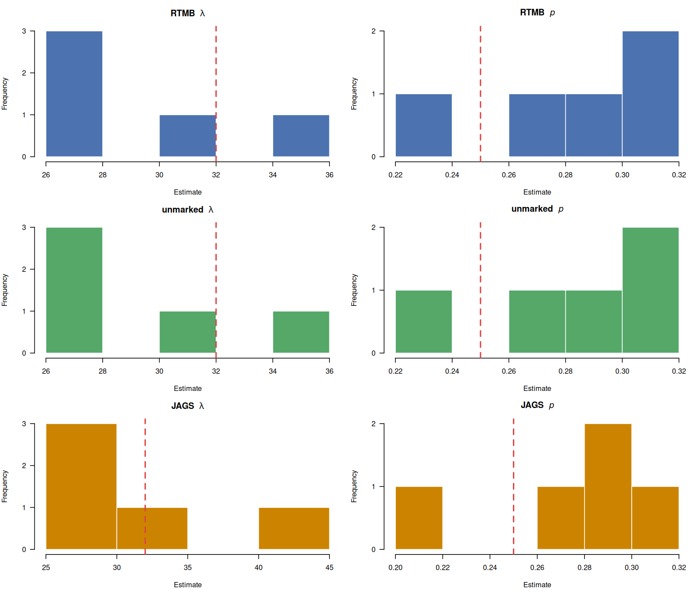
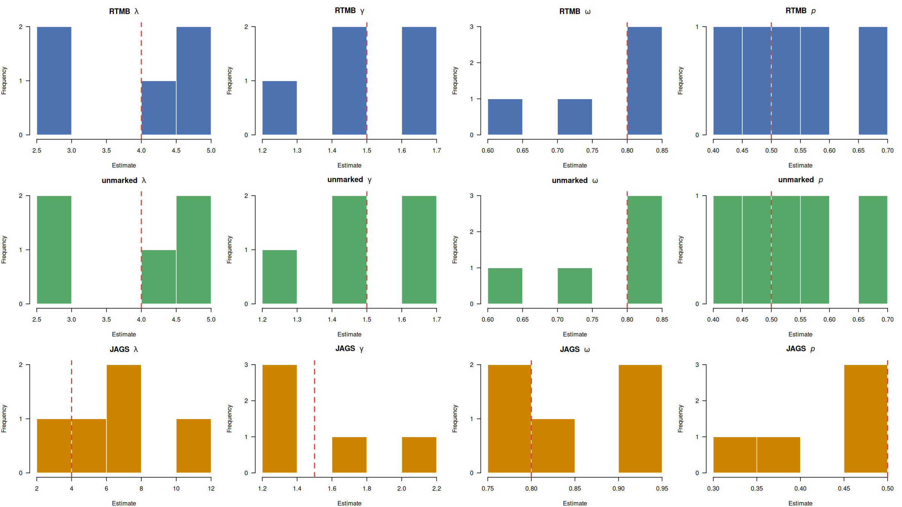
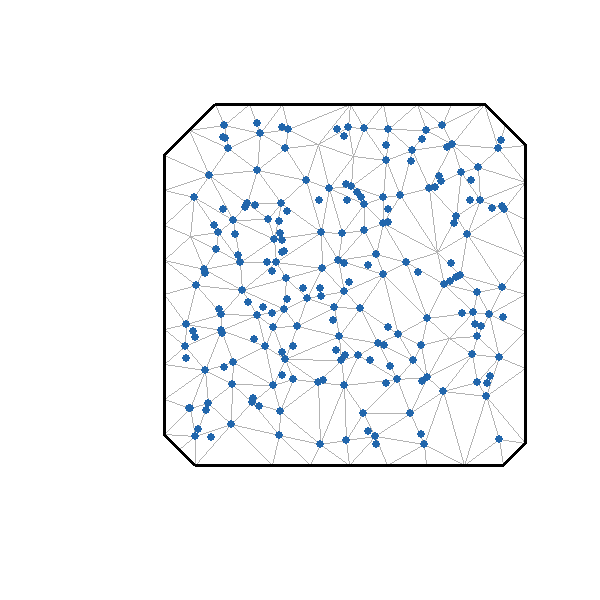
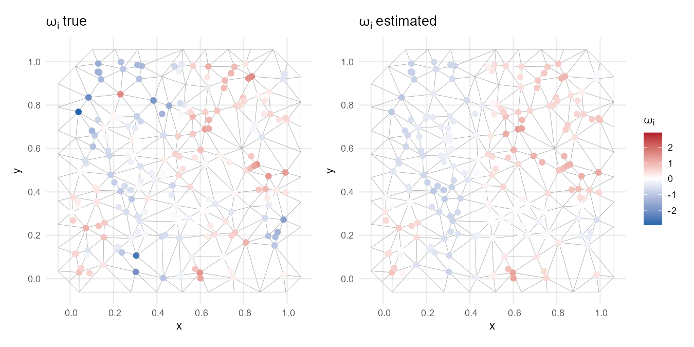

# Discrete Latent Variable Models in RTMB
Occupancy, N-mixture, and open population models such as the Dail-Madsen are among the most widely used statistical tools in wildlife ecology, yet all share a common challenge: inference requires integrating over discrete latent states that are never directly observed. Automatic differentiation frameworks like TMB and its derivatives have historically struggled with this class of models. This has largely excluded such models from the ADMB/TMB/RTMB ecosystems. Here we implement all three models in RTMB using sum-reduction and a forward algorithm to marginalize over discrete latent states, and compare parameter recovery and computational performance against `unmarked`, a widely used package purpose-built for this class of models, and `JAGS`, a general-purpose Bayesian sampler.

## Quick Start

```bash
git clone https://github.com/ChrisFishCahill/RTMBdre.git
cd RTMBdre
make install        # install required R packages (system JAGS must be installed first)
time make           # sequential run
time make parallel  # parallel run - distributes simulations across all available cores
```

This runs the simulation and all results and plots are saved to `results/` and `figures/`.

## Models

### Occupancy (MacKenzie et al. 2002)
Discrete latent occupancy state `z_i` marginalized via **Sequential Reduction (SR)** in RTMB; sampled explicitly via MCMC in JAGS:
```
z_i ~ Bernoulli(psi)
y_ij | z_i ~ Bernoulli(z_i * p)
```

### N-mixture (Royle 2004)
Discrete latent abundance `N_i` marginalized via **Sequential Reduction (SR)** in RTMB; sampled explicitly via MCMC in JAGS:
```
N_i ~ Poisson(lambda)
y_ij | N_i ~ Binomial(N_i, p)
```

### Dail-Madsen (Dail & Madsen 2011)
Temporally dependent latent abundance `N_it` marginalized via **Forward Algorithm** in RTMB; full latent state space `N_it`, `S_it` sampled explicitly via MCMC in JAGS:
```
N_i1 ~ Poisson(lambda)
S_it | N_it ~ Binomial(N_it, omega)
G_it ~ Poisson(gamma)
N_it+1 = S_it + G_it
y_it | N_it ~ Binomial(N_it, p)
```

## Results
Histograms represent distributions of estimates from 100 simulated datasets. For RTMB and unmarked these are maximum likelihood estimates; for JAGS these are posterior means (4 chains, 20000 iterations, 10000 burnin for occupancy and N-mixture; 100000 iterations, 50000 burnin for Dail-Madsen). True values used for simulation are indicated by the red vertical lines.

### Occupancy


### N-mixture


### Dail-Madsen


## Timing

Mean time per fit (seconds), averaged over 100 simulations. JAGS timings include the full chain: adaptation, burnin, and sampling. All three frameworks fit identical simulated datasets.

| Model | RTMB (s) | unmarked (s) | JAGS (s) | RTMB vs unmarked | RTMB vs JAGS |
|---|---|---|---|---|---|
| Occupancy | 0.044 | 0.021 | 6.437 | 0.5x | 146.3x |
| N-mixture | 0.091 | 0.164 | 25.801 | 1.8x | 283.5x |
| Dail-Madsen | 0.031 | 0.035 | 181.686 | 1.1x | 5860.8x |

*JAGS columns will be populated on first run.*

The occupancy model in `unmarked` uses a closed-form marginal likelihood, requiring fewer function evaluations than RTMB's sequential reduction over {0,1}. `unmarked` is therefore expected to be faster for this specific case.

The JAGS Dail-Madsen is expected to be substantially slower than RTMB. JAGS must sample the full latent state space — `N_it` and `S_it` at every site and time step — via Gibbs steps. RTMB avoids this entirely by marginalizing out the discrete states analytically via the forward algorithm, never touching the latent space during optimization. This difference in wall time is a central motivation for the RTMB approach.

## JAGS MCMC Settings

JAGS settings are configurable at the top of `run_all.R` and `run_all_parallel.R`. Occupancy and N-mixture use shorter chains; Dail-Madsen requires longer runs due to the complexity of its latent state space.

| Setting | Occupancy & N-mixture | Dail-Madsen | Notes |
|---|---|---|---|
| `n.chains` | 4 | 4 | independent chains for convergence assessment |
| `n.iter` | 20000 | 100000 | total iterations per chain including burnin |
| `n.burnin` | 10000 | 50000 | discarded warmup iterations |
| `n.thin` | 1 | 1 | thinning interval |

## MCMC Convergence Diagnostics

Convergence is assessed using the Gelman-Rubin potential scale reduction factor (R-hat; Gelman & Rubin 1992). R-hat compares within-chain to between-chain variance across the 4 independent chains — values near 1.0 indicate convergence, and a fit is flagged as converged when R-hat < 1.1 for all monitored parameters. Running multiple chains from dispersed initial values is essential: a single chain can appear to have converged while still exploring only a local region of the posterior.

Convergence rates across 100 simulations (proportion of fits with R-hat < 1.1 for all parameters):

| Model | Convergence Rate |
|---|---|
| Occupancy | 1.00 |
| N-mixture | 0.79 |
| Dail-Madsen | 0.33 |

The lower convergence rate for Dail-Madsen reflects the difficulty of sampling its high-dimensional latent state space — `N[i,t]`, `S[i,t]`, and `G[i,t]` must all be sampled explicitly via Gibbs steps at every site and time step. RTMB sidesteps this entirely by marginalizing out the discrete states via the forward algorithm, which is a central motivation for this work. Convergence rates and per-simulation R-hat values are printed to the console and saved in `results/timing_summary.md` on each run.

### References
- Gelman, A. and Rubin, D.B. (1992) Inference from Iterative Simulation Using Multiple Sequences. *Statistical Science* 7:457-472.

## Repository Structure

```
models/
  occupancy.R           # occupancy model - SR over Bernoulli latent; JAGS comparison embedded
  nmixture.R            # N-mixture model - SR over Poisson latent; JAGS comparison embedded
  dail_madsen.R         # Dail-Madsen model - forward algorithm; JAGS comparison embedded
  dail_madsen_spde.R    # spatial Dail-Madsen with GMRF on lambda via SPDE
figures/               # plots (created on run)
results/               # .rds results and timing summary (created on run)
run_all.R              # master script (sequential)
run_all_parallel.R     # master script (parallel, one sim per core)
install.R              # installs required R packages
Makefile
```

Each model file contains RTMB, unmarked, and JAGS fits in a single internal worker function (`fit_all_occ`, `fit_all_nmix`, `fit_jags_dm`) that operates on the same simulated dataset. This ensures all timing comparisons are made on identical data.

## Usage

```bash
make                                      # run all models sequentially via run_all.R
make parallel                             # run all models in parallel (one sim per core)
make occupancy                            # run occupancy only one time
make nmixture                             # run N-mixture only one time
make dailmadsen                           # run Dail-Madsen only one time
make spde                                 # run spatial Dail-Madsen (SPDE) only one time
make install                              # install required R packages
make clean                                # remove results and figures
```

## A Nontrivial Extension: Spatial GMRF on Initial Abundance

While it is reassuring that RTMB recovers estimates comparable to `unmarked` for the three baseline models, a more compelling motivation for working within this framework is the flexibility it affords for model extensions that fall outside what `unmarked` can accommodate. Here we demonstrate one such extension by constructing a Dail-Madsen model with a spatial random effect on initial abundance, implemented via the Stochastic Partial Differential Equation (SPDE) approach. Specifically, we leverage RTMB's ability to work with sparse precision matrices to place a Gaussian Markov Random Field (GMRF) on log(λᵢ), allowing initial abundance to vary continuously across space.

`models/dail_madsen_spde.R` extends the Dail-Madsen model with a spatial random effect on initial abundance via the SPDE approach. Site-level log-abundance is modeled as:

```
log(lambda_i) = mu_lambda + omega_i
omega_s ~ GMRF(0, Q / tau^2)
Q = kappa^4 * M0 + 2 * kappa^2 * M1 + M2
```

where `Q` is the SPDE precision matrix constructed from `fmesher` FEM matrices `M0`, `M1`, `M2`. The continuous random effect `omega_s` is integrated out by RTMB's Laplace approximation; discrete latent `N_it` by the forward algorithm as before.

```bash
time make spde # spde dail-madsen runs in ~5-10 seconds
```

### Mesh and site locations

Sites are placed at random locations in the unit square. A triangulated mesh is built over the sites and the spatial field is simulated on mesh vertices then projected to site locations via the projection matrix `A_is`.



### Estimated vs true spatial field

The colour scale is shared across both panels and centred at zero.



## Dependencies

```bash
make install
```

This runs `install.R` which installs all required R packages (`RTMB`, `unmarked`, `R2jags`, `fmesher`). JAGS also requires a system-level installation before `R2jags` will work:

- **Debian/Ubuntu**: `sudo apt-get install jags`
- **macOS**: `brew install jags`
- **Windows/other**: https://mcmc-jags.sourceforge.io

## Planned Extensions

- NIMBLE implementations
- Unified timing comparison across RTMB, unmarked, JAGS, and NIMBLE

## References

- Dail, D. and Madsen, L. (2011) Models for Estimating Abundance from Repeated Counts of an Open Metapopulation. *Biometrics* 67:577-587.
- MacKenzie, D.I. et al. (2002) Estimating Site Occupancy Rates When Detection Probabilities Are Less Than One. *Ecology* 83:2248-2255.
- Royle, J.A. (2004) N-Mixture Models for Estimating Population Size from Spatially Replicated Counts. *Biometrics* 60:108-115.

