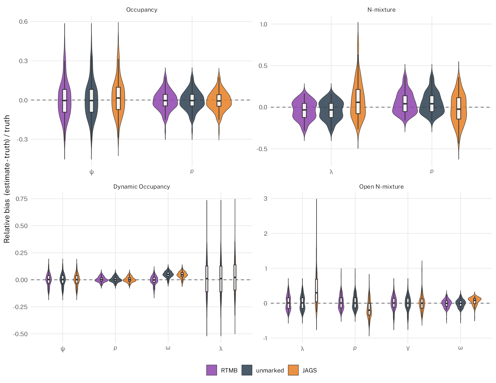
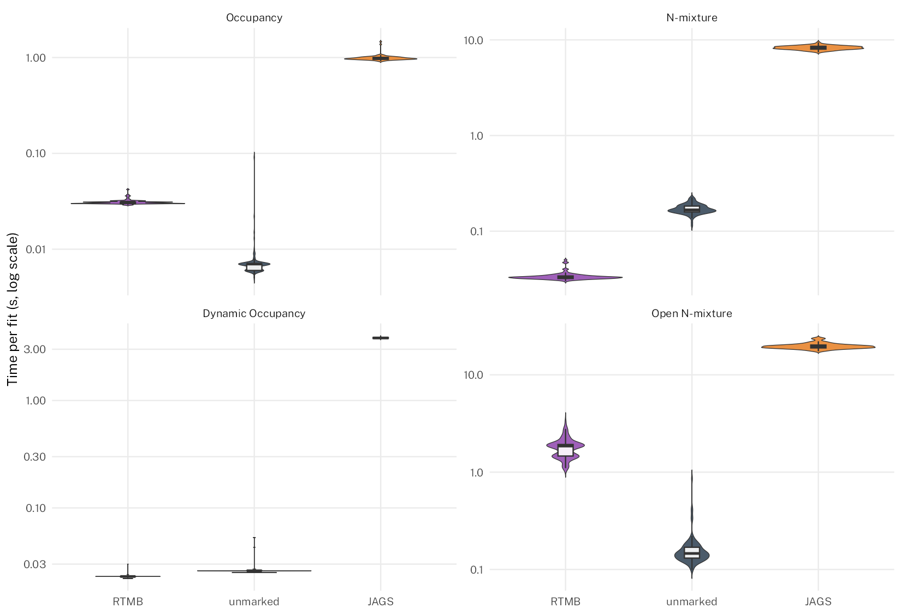

# Sequential Reduction for Discrete-Valued Latent Variables in RTMB

Occupancy and abundance (e.g., N-mixture) models, including their dynamic versions that are open to demographic changes, require integrating over discrete latent states. Discrete-valued latent variables also arise in other evolutionary models, e.g., state-switching for species traits in phylogenetic trait imputation.  This repo implements them in RTMB using Sequential Reduction (SR) to automatically marginalize those states, and compares parameter recovery and runtime against `unmarked` and `JAGS` and also includes new spatial and mixed-type extensions.

## Quick start

``` bash
git clone https://github.com/James-Thorson/RTMBdre.git
cd RTMBdre
make          # install pkgs, run everything and save outputs/figures
make clean    # remove results/ and figures/ outputs
make NSIM=1   # debugging mode; else runs NSIM = 100 (set in Makefile)
### NOTE ###  # the random seed is set in the Makefile and passed to other scripts
```

## Models

- `models/occupancy.R` — occupancy (MacKenzie et al. 2002)
- `models/dynamic_occupancy.R` — dynamic occupancy (MacKenzie et al. 2003)
- `models/nmixture.R` — N-mixture (Royle 2004)
- `models/open_nmixture.R` — open N-mixture / Dail-Madsen (2011)
- `models/open_nmixture_spde.R` — open N-mixture with a spatial GMRF (SPDE)
- `models/phylogenetic_mixed_traits.R` — phylogenetic trait imputation

## Results





JAGS model convergence across simulations, regenerated from current `results/*.rds`:

```         
Occupancy:         nsim=100  Rhat<1.1=100%
Dynamic Occupancy: nsim=100  Rhat<1.1=100%
N-mixture:         nsim=100  Rhat<1.1=86%
Open N-mixture:    nsim=100  Rhat<1.1=14%
```

## JAGS MCMC settings

Set at the top of each script; `n.chains` chains run in parallel (`jags.parallel()`) for all four models.

```         
Occupancy:         n.chains=4  n.iter=5000   n.burnin=2500   n.thin=1
Dynamic Occupancy: n.chains=4  n.iter=5000   n.burnin=2500   n.thin=1
N-mixture:         n.chains=4  n.iter=20000  n.burnin=10000  n.thin=1
Open N-mixture:    n.chains=4  n.iter=20000  n.burnin=10000  n.thin=1
```

## System info

Timing figures above were generated on:

```         
CPU:        AMD Ryzen Threadripper 9970X (32 cores / 64 threads)
RAM:        251 GiB
OS:         NixOS 26.11 (Zokor), Linux 7.1.5 x86_64
R:          4.6.1
BLAS/LAPACK: OpenBLAS 0.3.33, multi-threaded
RTMB:       1.9 kaskr/RTMB aea9b2d — sdreport_xtra fix made 2026-08-30
TMB:        1.9.25 kaskr/adcomp @ 9ce0af2, 2026-08-26
unmarked:   1.5.1
R2jags:     0.8.9
rjags:      4.17
JAGS:       4.3.2
```

## References

- Dail, D. and Madsen, L. (2011) Models for Estimating Abundance from Repeated Counts of an Open Metapopulation. *Biometrics* 67:577-587.
- MacKenzie, D.I. et al. (2002) Estimating Site Occupancy Rates When Detection Probabilities Are Less Than One. *Ecology* 83:2248-2255.
- MacKenzie, D.I. et al. (2003) Estimating Site Occupancy, Colonization, and Local Extinction When a Species Is Detected Imperfectly. *Ecology* 84:2200-2207.
- Royle, J.A. (2004) N-Mixture Models for Estimating Population Size from Spatially Replicated Counts. *Biometrics* 60:108-115.
